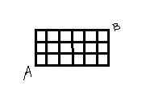
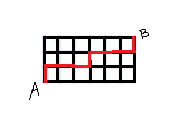

% Chapter 3 notes
% Math 432

# Elementary Counting Problems

Let $S_n$ be all permutations of 1, 2, ..., $n$. (Symmetric group). (So if $n=3$,

$$
S_3 = \{123, 132, 213,231, 312, 321\}
$$

)

Clearly $|S_n| = n (n-1) … (3)(2)(1)$. We know this as $n!$ (Take $0! = 1$).

## Sterling's Formula

$n!$ is asympototic to $\sqrt{2\pi n} \left(\frac{n}{e}\right)^n$. 

## How many different sequences have three 1s, four 2s, and two 3s?

Any such sequence has length 9. Define a map:

$$
f: S_n \mapsto \text{these sequences:} 
$$

|4, 1, 8, 2, 5, 3, 7, 6, 9|

 ```
 |
 |
 V
```

|2, 1, 3, 1, 2, 1, 2, 2, 3|

We:

* wrote down the 1s in the positions of 1, 2, 3

* Then the 2s in the positions of 4, 5, 6, 7

* Then the 3s in the positions of 8, 9

_Note:_ the map $f$ is onto

and the number of permutations mapping to a given seqeuence is

$$
3! \times 4! \times 2!
$$

The total number of sequences is

$$
\frac{|S_9|}{3! \times 4! \times 2!} = \frac{9!}{3! \times 4! \times 2!}
$$

### More generally

 Let $n, k, a_1, ..., a_k$ be non-negative integers such that

$$
n = a_1 + a_2 + … + a_k
$$

Consider the length $n$ sequences consisting of $a_1$ 1s, $a_2$ 2s, $a_3$ 3s, … etc. The total number of sequences is 

$$
\frac{n!}{a_1! \times a_2! \times a_3! ... \times a_k!}
$$

_Proof_ same as previous example

_Ex_

The number of distinct arrangements of the letters of the word "mississippi" is

$$
\frac{11!}{1! 2! 4! 4!}
$$

(1 'm', 2 'p's, 4 's's, 4 'i's)

## Let's count permutations of $1,2,...n$ by "cycle structure"

Consider the permutation

$\Pi = 3, 4, 9, 2, 5, 6, 8, 7, 1$

|1|2|3|4|5|6|7|8|9|
|---|---|---|---|---|---|---|---|---|
|3|4|9|2|5|6|8|7|1|

can thing of these as "cycles"

* 1 → 3 → 9 → 1…

* 2 → 4 → 2…

* 5 → 5…

* 6 → 6…

* 8 → 7 → 8…

can write this as 

$$
(5)(6)(2, 4)(7, 8)(1,3,9)
$$

let $n_i(\Pi) =$ the number of cycles of $\Pi$ of length $i$

So $n_1(\Pi) = 2$, $n_2(\Pi)=2$, $n_3(\Pi) = 3$.

**Theorem**) Let $n_1, n_2, n_3, ...$ etc be integers such that $\sum_i in_i = n$. Then the number of permutations in $S_n$ with $n_1$ 1-cycles, $n_2$ 2-cycles, … etc is equal to $\frac{n!}{\Pi i^{ni}(ni!)}$. 

_Proof_ Define a map $f: S_n\mapsto$ permutations with $n_1$ 1-cycles, $n_2$ 2-cycles, … etc. Let's define this "by example". 

Suppose $n = 14$, $n_1=2$, $n_2=1$, $n_3 = 2$, $n_4 = 1$. 

$$
4, 1, 14, 12, 9, 10, 8, 7, 13, 11, 2, 5, 6, 3
$$
→ ...
(4)(1) - 1-cycles
(14, 12) - 2-cycle
(9,10, 8), (7, 13, 11)
(2, 5, 6, 3)

This map is onto. And each permutation with $n_1$ 1-cycles, $n_2$ 2-cycles, … etc is mapped to $\Pi_i i^{ni}(ni!)$ many times. You can swap any of the 3-cycles around (change (9, 10, 8) → (10, 8, 9)) and it's the same groupings. More generally, that's the term of $i^{ni}$. Then you can switch out two $n$-cycle permutations (can switch: (4)(1) → (1)(4)) which is the $ni!$ term. We do this for every $i$ (the $\Pi_i$) the number of permutations with $n_1$ 1-cycles, $n_2$ 2-cycles, … etc, is $\frac{n!}{\Pi_i i^{ni}(ni!)}$. 

_Later when we talk about generating functions, we will give applications of this formula_

## Some examples

_Example_) The number of 6 digit strings on an alphabet a, b, ..., c 

$$
= 26 \times 26 \times … 26 = 26^6
$$

_Example_) The number of subsets of an $n$-element set is $2^n$. For each of the $n$ elements, you have 2 choices: be in the subset, or not. 

_Example_) Let $n, k$ be positive integers with $n \geq k$. then the number of length $k$ strings of an $n$-element alphabet where all symbols in the the string are different is 

$$
n \times (n-1) \times … \times (n-k+1) = \frac{n!}{(n-k)!}
$$


_Proof_ Have $n$ choices for first symbol. Then $n-1$ choices for next symbol, etc.

## Binomial Coefficients

Let $\begin{pmatrix}n \\k\end{pmatrix} =$ the number of k element subsets of $1, 2, ..., n$ where order does not matter.

For example, $\begin{pmatrix}4\\2\end{pmatrix}$ = 6 since there are 6 2-element subsets of 1,2,3,4.

$$
\{1,2\}, \{1,3\}, \{1,4\}, \{2,3\}, \{2,4\}, \{3,4\}
$$

**Theorem**

$$
\begin{pmatrix}n\\k\end{pmatrix} = \frac{n!}{(n-k)!k!}
$$

_Proof_) To pick a $k$ element subset of 1,2,...,$n$, first select a $k$ element string consisting of $k$ distinct elements of $\{1, 2, ..., n\}$. This can be done in $\frac{n!}{(n-k)!}$ ways. Define a map $f: \text{ these sequences } \mapsto \text{ size } k \text{ subsets of } \{1, 2, ..., n\}$ forgetting the order of the elements in the sequence. Each size $k$ subset gets hit $k!$ times, so the total number of $k$ size subsets 

$$
\frac{\frac{n!}{(n-k)!}}{k!} = \begin{pmatrix}n\\k\end{pmatrix}
$$

_ex_)

$$
\begin{pmatrix}n\\k\end{pmatrix} = \begin{pmatrix}n-1\\k\end{pmatrix} + \begin{pmatrix}n-1\\k-1\end{pmatrix}
$$

_Proof 1 (combinatorial - just counting, no formulas)_)

Consider the $k$ element subsets of $\{1, 2, …, n\}$. On one hand, this is equal to $\begin{pmatrix}n\\k\end{pmatrix}$. On the other hand, have 2 possibilities:

1. The subset contains 1

2. The subset does not contain 1

(1) occurs in $\begin{pmatrix}n-1\\k-1\end{pmatrix}$ ways (choose $k-1$ elements from $\{2, ..., n\}$)

(2) occurs in $\begin{pmatrix}n-1\\k\end{pmatrix}$ ways (choose $k$ elements from $\{2, ..., n\}$)

which completes the proof.

_Proof 2_)

$$
\begin{aligned}
\begin{pmatrix}n-1\\k\end{pmatrix} + \begin{pmatrix}n-1\\k-1\end{pmatrix} = \frac{(n-1)!}{k!(n-k-1)!} + \frac{(n-1)!}{(k-1)!(n-k)!} \\
= \frac{(n-1)!(n-k)}{k!(n-k)!} + \frac{(n-1)!k}{k!(n-k)!} \\
= \frac{(n-1)!n}{k!(n-k)!} \\
= \frac{n!}{k!(n-k)!} \\
= \begin{pmatrix}n\\k\end{pmatrix}
\end{aligned}
$$

### Some applications

#### Counting lattice paths

_ex_ 4 x 7



Count the paths from A to B which at each step, go up or go right.



This path is (URRRURRRU).

_How many such paths are there?_

Answer is $\begin{pmatrix}9\\3\end{pmatrix}$ since you have 9 steps and choose which 3 of them go up. What about $\begin{pmatrix}9\\6\end{pmatrix}$? Well, $\begin{pmatrix}9\\3\end{pmatrix} = \begin{pmatrix}9\\6\end{pmatrix}$.

#### Theorem

There are $\begin{pmatrix}n-1\\r-1\end{pmatrix}$ distinct positive integer valued vectors 

$$
(x_1, … x_r)
$$

such that $x_1 + … + x_r = n$.

[Solution]{.underline}

Use the "stars and bars" argument

i.e.

$**|***|*|* \rightarrow 2+ 3 + 1 + 1 = 7$


Have to place $r-1$ bars in some of the $n-1$ positions. So the answer is $\begin{pmatrix}n-1\\r-1\end{pmatrix}$.

#### Slight Variation

There are $\begin{pmatrix}n+r-1\\r-1\end{pmatrix}$ distinct non-negative (the other one was positive) integer value vectors

$$
(x_1, … x_r)
$$

such that $x_1 + … + x_r = n$.

[Solution]{.underline}

Let $y_1=x_1+1, y_2=x_2+1...y_r = x_r+1$. Then $(y_1,...,y_r)$ is a positive integer valued vector satisfying $y_1 + … + y_r = n + r$. We can now use the previous theorem, and the solution is $\begin{pmatrix}n+r-1\\r-1\end{pmatrix}$.
