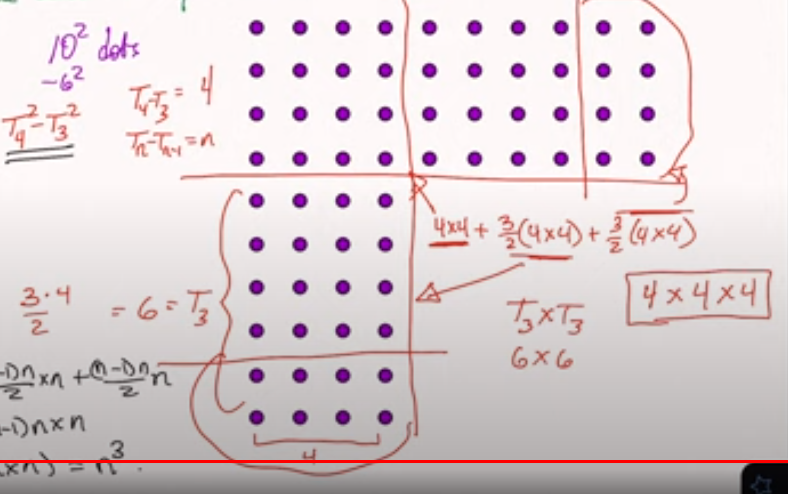
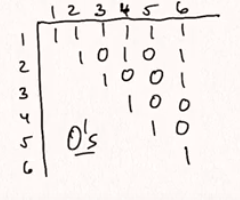

# Counting in 2 ways

How many dots are in a $(n+1) \times (n+1)$ grid?

## Method 1 (Count by Area)

$(n+1)^2$ dots.

_ex_ $n=4$, ($n+1 = 5$)

## Method 2 (by diagonals)

$(n+1)$ - middle

$2(1 + 2 + … + n)$ - diagonals

$$
\begin{aligned}
(n+1)^2 = (n+1) + 2(1 + 2 + … + n) \\
(n+1)^2 - (n+1) = 2(1 + 2 + … + n) \\
(n+1)(n+1-1) = 2 (1 + 2 + … + n) \\
\frac{(n+1)n}{2} = 1 + 2 + … n
\end{aligned}
$$

# Some more

Square #s

1, 4, 9, 16, 25, 36, …

Cube #s

1, 8, 27, 64, 125

Triangle #s

1, 3, 6, 10, 15, 21,…

$1 + 2 + … + n = \frac{n(n+1)}{2}$

_Example_

Show the difference between the squares of two consecutive triangle numbers is a cube. 

$3^2 - 1^2 = 2^3$, $6^2 - 3^2 = 3^3$, $10^2-6^2=4^3$, $15^2 - 10^2 = 5^3$

Why is this true?

For the case $10^2 - 6^2 = 4^3$, we can see that $T_4^2 - T_3^2 = 4$, and this (removing them from the grid) leaves $T_3 = 6$ (using $\frac{n(n+1)}{2}$) twice. In other words $T_n^2 - T_{n-1}^2 = n \times n + \frac{(n-1)n}{2}\times n + \frac{(n-1)n}{2}\times n = (1 + (n-1)) \times n \times n$ or $n^3$.

# Some more examples

Show the average number of divisors of $1, 2, …, n$ is approximately $\log(n)$. 

|Divisors:| |
|---|---|
|1|1|
|2|1, 2|
|3|1,3|
|4|1, 2, 4|
|5|1, 5|
|6|1, 2, 3, 6|

$\frac{1 + 2 + 2 + 3 + 2 + 4}{6} = 2.3$

$\log(6) = 1.8$

$\text{div}(100) = 4.82$

$\log(100) = 4.61$

Make an array ($n \times n$)

$$
a_{ij} = \begin{cases}1 & \text{ if i divides j} \\ 0 & \text{else}\end{cases}
$$

Count by columns:

$$
\frac{1}{n} \sum_{j=1}^n \left(\sum_{i=1}^n a_{ij}\right) = \frac{1}{n} \sum_{j=1}^n \left(\text{number of divisors of j}\right)
$$

= average # of divisors of 1,2, ..., n

Count by rows: (row $i$, every $i$th entry is 1, others are 0).

$$
\begin{aligned}
\frac{1}{n}\sum_{i=1}^n \left(\sum_{j=1}^n a_{ij}\right) = \frac{1}{2} \sum_{i=1}^n \left(\lfloor \frac{n}{i}\rfloor\right)  \\
\approx = \frac{1}{n}\sum_{i=1}^n \frac{n}{i} = \sum_{i=1}^n\frac{1}{i} \approx \log(n) \text{ (using calculus: Reimann sums)}
\end{aligned}
$$

