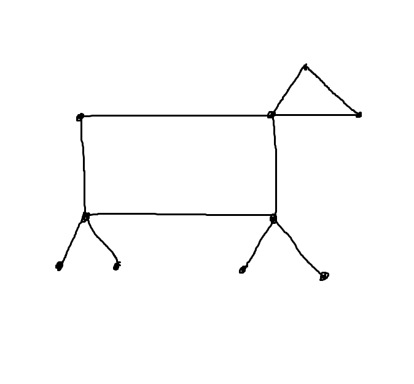

% Some Stuff Not in the Book Notes
% Math 432

# Some Stuff Not in the Book

_Fun topic!_

## Double counting

Suppose you have finite sets $R$ and $C$ and a subset $S \subseteq R \times C$. When $(p, q) \in S$, we say $p,q$ are incident. 

_**Theorem**_

For $p\in R$, let $r_p=$number of elements incident to $p$ and for $q \in C$, $c_q =$ number of elements incident to $q$. Then

$$
\sum_{p \in R} r_p = |S| = \sum_{q \in C} c_q
$$

_Proof_

$\sum_{p\in R} r_p$ counts elements in $S$ by their first incidents, so this sum is equal to $|S|$. Similarly, $\sum_{q\in C} c_q$ counts eleemtns in $S$ by their second coordinate. 

Another way to picture this:

define matrix $A$ (called the incidence matrix of $S$). Rows and columns of $A$ are indexed by $R$ and $C$ respectively. And 
$a_{pq} =$ $p,q$ entry of $A$

$$
a_{pq} = \begin{cases}1 & \text{if } (p,q) \in S \\ 0 &\text{else}\end{cases}
$$

Note: 

$r_p =$ sum of $p$th row of $A$
$c_q =$ sum of $q$th column of $A$

_Ex_) Let $R=C=\{1,...,8\}$ let $S = \{(i, j) : i \text{ divides }j\}$. So $A$ is given by:

| |1|2|3|4|5|6|7|8|
|---|---|---|---|---|---|---|---|---|
|1|1|1|1|1|1|1|1|1|
|2|0|1|0|1|0|1|0|1|
|3|0|0|1|0|0|1|0|0|
|4|0|0|0|1|0|0|0|1|
|5| | | | | | | | |
|6| | | | | | | | | 
|7| | | | | | | | |
|8| | | | | | | | |

Consider the $j$th column of $A$. Then the number of 1s in the $j$th column is the number of divisors of $j$. Call this the $t(j)$. Let's ask how large $t(j)$ is on average, when $j$ ranges from $1,...,n$. Call this $\overline{t}(n) = \frac{1}{n}\sum_{j=1}^n t(j)$. 

This seems hopeless. Indeed, if $j$ is prime $t(j) = 2$. Also $t(2^k) = k+1$. So the $t(j)$s fluctuate a lot. But something nice happens.

Consider matrix $A$ where $R, C = \{1, … , n\}$ and $S = \{(i, j) : i \text{ divides } j\}$. Counting $|S|$ according to columns

$$
\sum_{j=1}^n = t(j)
$$

How many 1s are in the $i$th rows? Need to count the multiples of $i$ which is just $\lfloor \frac{n}{i}\rfloor$ (the greates integer less then or equal to $\frac{n}{i}$).

Thus,

$$
\begin{aligned}
\overline{t}(n) = \frac{1}{n} \sum_{j=1}^n t(j) \\
= \frac{1}{n} \sum_{i=1}^n \lfloor\frac{n}{i}\rfloor \\
\leq \frac{1}{n} \sum_{i=1}^n \frac{n}{i} \\
= \sum_{i=1}^n \frac{1}{1}
\end{aligned}
$$

Note: $\frac{1}{n} \sum_{i=1}^n \lfloor\frac{n}{i}\rfloor$ differs from $\frac{1}{n} \sum_{i=1}^n \frac{n}{i}$ by at most 1 $= \sum_{i=1}^n \frac{1}{i}$. Also $\sum_{i=1}^n \frac{1}{i}$ differs from $\log(n)$ by at most 1. Thus $\overline{t}(n)$ differs from $\log(n)$ by at most 2. So in particular, $\overline{t}(n)$ is asymptotic to $\log(n)$.

_Table_:

|n|1|2|3|4|5|6|7|8|
|---|---|---|---|---|---|---|---|---|
| |1|$\frac{3}{2}$|$\frac{5}{3}$|2|2|$\frac{7}{3}$|$\frac{16}{7}$|$\frac{5}{2}$|

_Exercise before next time_

Let $a$ be a graph

Let $d(v)$ = degree of $v$ (= number of edges with v as an end point)

_Prove_ 

$$
2 (\text{ number of edges }) = \sum_v d(v)
$$