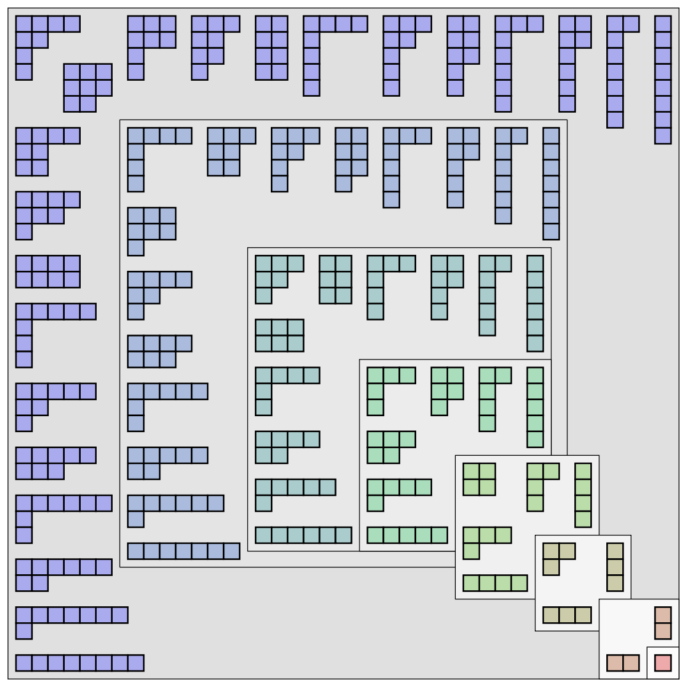

% Chapter 5
% Math 432

# Partitions

## Definition

A sequence $(a_1, a_2, …, a_k)$ of non-negative integers which sum to $n$ is called a _weak composition_ of $n$. If we require that the $a_i$s are all positive, we get a _composition_ of $n$. We call $a_1, a_2,...,a_k$ the _parts_ of the composition. Earlier we proved

1. For $n, k > 0$ the number of weak compositions of $n$ into $k$ parts is $\begin{pmatrix}n+k-1\\k-1\end{pmatrix}$.

2. For the number of compositions of $n$ into $k$ parts is $\begin{pmatrix}n-1\\k-1\end{pmatrix}$.

## Corollary

For all positive integers $n$, the total number of compositions is $2^{n-1}$.

_Ex: Let $n=3$, the possible compositions are $\{3\}, \{2+1\}, \{1+2\}, \{1+1+1\}$._

Exercise: _Try to prove the corollary_

_Proof_

A composition of $n$ has at least 1 and at most $n$ parts. So the number of compositions of $n$ 

$$
\begin{aligned}
 = \sum_{k=1}^n \text{number of composition with $k$ parts} \\
= \sum_{k=1}^n \begin{pmatrix}n-1\\k-1\end{pmatrix} \\
= \sum_{j=0}^{n-1} \begin{pmatrix}n-1\\j\end{pmatrix} = 2^{n-1}
\end{aligned}
$$

_(The final line from the binomial theorem)_

# Set Partitions

A partition of the set $\{1, ..., n\}$ is a collection of non-empty blocks such that each of $1, ..., n$ belongs to exactly one of the blocks.

Let $S(n, k) =$ the number of set partitions of $\{1,...,n\}$ into $k$ blocks. Thus $S(n, k) = 0$ if $n < k$ (you can't partition $n$ things if you have too many blocks). Set $S(0, 0) = 0$. Call $S(n, k)$ the "Sterling numbers of the second kind". _(Order of the blocks don't matter)_

_Ex: $S(4,2) = 7$. Since the set partitions of $\{1, 2, 3, 4\}$ into 2 blocks:

$$
\begin{aligned}
\{1,2,3\}\{4\}, \{1,2,4\}\{3\}, \{1,3,4\}\{2\}, \{2,3,4\}\{1\} \\
\{1,2\}\{3,4\}, \{1,3\}\{2,4\}, \{1,4\}\{2,3\}
\end{aligned}
$$

_Ex: $S(n, n-1) = \begin{pmatrix} n \\ 2\end{pmatrix}$. A set partition of $\{1,...,n\}$ into $n-1$ blocks has $n-2$ blocks of size 1 and 1 block of size 2. And you can pick the block of size 2 in $\begin{pmatrix}n\\2\end{pmatrix}$.

## Theorem 

For all postitive integers $k < n$. 

$$
S(n, k) = S(n-1, k-1) + k S(n-1, k)
$$

(Allows you to compute quickly on a computer)

_Proof_

Consider a set partition of $\{1,2,...,n\}$ into $k$ blocks. There are 2 cases. 

1. $n$ is a block of size 1. Then $\{1, 2, ..., n-1\}$ are in $k-1$ blocks. So this occurs in $S(n-1, k-1)$ ways.

2. $n$ is not in its own block. Then $\{1, 2, ..., n-1\}$ are partitioned into $k$ blocks. Then you chose one of the $k$ blocks to choose which to insert into $n$. Case 2 occurs in $S(n-1, k)$ multiply by $k$.

## Theorem (Sort of Neat)

The number of onto functions 

$$
f:\{1,2,...,n\} \mapsto \{1,2,...,k\}
$$

is equal to

$$
k! S(n,k)
$$

_Proof_

Onto functions correspond to set partitions of $\{1,...,n\}$ into $k$ blocks with an ordering on the blocks. Why? The 1st block $= f^{-1}(1) =$ things that $f$ sends to 1. The 2nd block $=f^{-1}(2)$... $k$th block $= f^{-1}(k)$. 

## Define

$$
B_n
$$

The number of set partitions of $\{1, ..., n\}$. The "**Bell number**". So $B(3) = 5$ since

$$
\{1,2,3\}, \{1,2\}\{3\}, \{1,3\}\{2\}, \{2,3\}\{1\}, \{1\}\{2\}\{3\}
$$

_Note_ $B(5) = 52$ (And there's a card trick regarding that)

_**Remark**_

1. $B(n) = \frac{1}{e}\sum_{k\geq 0} \frac{k^n}{n!}$

For example, if $n=1$,

$$
\begin{aligned}
B(1) = \frac{1}{e} \sum_{k\geq 0} \frac{k}{k!} \\
= \frac{1}{e} \sum_{j\geq 0} \frac{1}{j!} \\
= \frac{1}{e} e = 1
\end{aligned}
$$

(using 

$$
e^z = \sum_{j\geq 0} \frac{z^j}{j!}
$$

)

2. $B(n+1) = \sum_{i=0}^n \begin{pmatrix}n\\i\end{pmatrix} B(i)$.

_Proof_ 

Let's show that the right hand side enumerates all set partitions of $\{1,2,...,n+1\}$. Suppose $n+1$ is a block of size $n-i+1$. Then there are $i$ elements not in same block as $n+1$. You can choose these $i$ elements in $\begin{pmatrix}n\\i\end{pmatrix}$ ways and make them into a set partition in $B(i)$ ways. Summing over $i$ proves the theorem. 

# Integer Partitions

## Definition

Let $a_1 \geq a_2 \geq … \geq a_k \geq 1$ be integers so that $a_1 + a_2 + … + a_k = n$. Call the sequence 

$$
(a_1, ...,a_k) 
$$

a partition of $n$. 

Let $p(n) =$ the number of partitions of $n$. $p_k(n) =$ the number of partitions of $n$ into parts. 

_Example_

$p(4) = 5$, since the partitions of 4 are

$$
\begin{aligned}
(4)\\
(3,1)\\
(2,2)\\
(2,1,1)\\
(1,1,1,1)
\end{aligned}
$$

Ferrers Diagram 

____

_**Remark**_

$p(n) \approx \frac{1}{4\sqrt{3}} e^{\pi\sqrt{\frac{2n}{3}}}$

## Theorem

The number of partitions of $n$ into at most $k$ parts $=$ the number of partitions of $n$ with all parts at most $k$. 

_Proof_

A partition of $n$ has at most $k$ parts if and only if Ferrers diagram has at most $k$ rows. Also, a partition has all parts at most $k$ if and only if the ferrers diarram has at most $k$ columns. The _conjugate_ of a Ferrers diagram is given by "flipping the diagram".

____

So by taking conjugates, we see that the number of Ferrers diagram with at most $n$ rows is equal to the number of Ferrers diagram with with at most $k$ columns.

## Another Theorem

The number of self-conjugate partitions of $n$ is equal to the number of partitions of $n$ into distinct odd parts

_example_ 

$n = 5$. partitions into distinct odd parts = (5).  Self-conjugate partitions: 

_Proof_

Let's define $f :$ self conjugate partitions of $n$ → 2 partitions of $n$ into distinct odd parts. 

$$
\begin{bmatrix}1&1&1&1&1\\1&2&2&2&2\\1&2&3&&\\1&2\\1&2\end{bmatrix} \mapsto \begin{bmatrix}1&1&1&1&1&1&1&1&1\\2&2&2&2&2&2&2\\3\end{bmatrix}
$$

Can invert $f$ so $f$ is a bijections and theorem is proved

## Next theorem

Let $p(n) =$ number of partitions of $n$. Then $p(n) - p(n-1)=$ the number of partitions of $n$ with no parts of size 1.

_Proof_

It's enough to show that $p(n-1) =$ number of partitions of $n$ with at least 1 part of size 1. 

Define a map: $f:$ partitions of $n-1$ $\mapsto$ partitions of $n$ with at least 1 part of size 1. $f$ adds one row of size 1

_Example_

$f:$ 

$$
\begin{matrix} X & X & X \\ X & X & X\end{matrix} \quad \mapsto \quad \begin{matrix}X & X & X \\ X & X & X \\ X & & \end{matrix}
$$

Clearly $f$ is a bijection so the result follows. 

## Theorem

$$
\sum_{n\geq 0} p(n) z^n = \Pi_{i \geq 1} \frac{1}{1-z^i}
$$

_Proof_

Need to show $p(n) =$ coefficient of $z^n$ in $\Pi_{i \geq 1} \frac{1}{1-z^i}$. 

$$
\Pi_{i \geq 1} \frac{1}{1-z^i} = (1 + z + z^2 + z^3+...)(1+z^2+z^4+...)(1+z^3+z^6+...)…
$$

take $z^2, z^6, z^3$ terms. partition of 11 into 2 partitions of size 1, 3 partitions of size 2, and 1 partitions of size 3.

## Theorem

Let $p_o(n)$ be the number of partition of partitions into odd parts. Let $p_d(n)$ be the number of partitions of $n$ into distinct parts. In fact, $p_o(n) = p_d(n)$.

_Example_

$n=6$

partitions of odd parts:

$$
\begin{matrix} (5, 1)\\(3,3) \\(3, 1, 1)\\(1, 1, 1, 1, 1)\end{matrix}
$$

partitions of distinct parts:

$$
\begin{matrix} (6)\\(5, 1)\\(4,2)\\(3,2,1)\end{matrix}
$$

_Proof_

Arguing as in previous theorem, 

$$
p_o(n)= \text{ Coefficient of } z^n\text{ in } \Pi_{i \text{ odd}} \frac{1}{1-z^i}
$$

$$
\begin{aligned}
p_d(n) = \text{ Coefficient of } z^n \text{ in } \Pi_{i\geq 1} (1+z^i)\\
= \text{ Coefficient of } z^n \text{ in } \Pi_{i\geq 1} \frac{1-z^2i}{1-z^i} \\
= \text{ Coefficient of } z^n \text{ in } \frac{\Pi_{i \text{ even}}(1-z^i)}{\Pi_{i\geq 1}(1-z^i)} \\
= \text{ Coefficient of } z^n \text{ in } \frac{1}{\Pi_{i \text{ odd}}(1-z^i)}
\end{aligned}
$$

The result follows. 

# Book

"Paritions" by George Andrews

