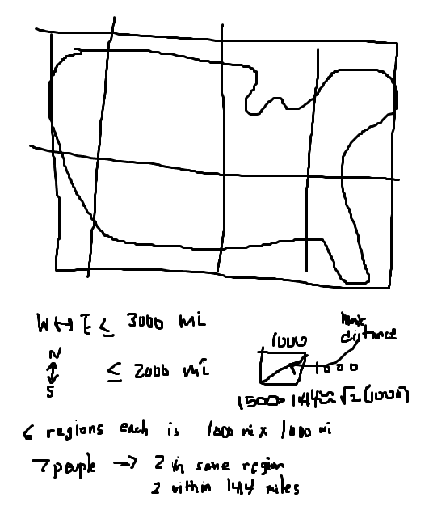

# Pigeonhole Principle

_"combinatorics is an honest subject. You can count balls in boxes and either you have the right number or you haven't"_ - Gian-Carlo ROTA

Combinatorics is a concrete subject: you can do it with your hands. Construct an image, draw an example.

---

_Pigeonhole Principle_

$k$ balls into $n$ boxes
 and $k > n$

$\rightarrow$ at least 1 box has 2 balls

When we have a statement that is _painfully_ obvious, we will use proof by contradiction.

__Proof__

Suppose not ($k > n$ s.t. no box has at least 2 balls _i.e. each box has $\leq$ 1 ball_). That means the number of balls $k$ must be at most the number of boxes $n$ (i.e. $k \leq n$). Which is a contradiciton.

---

__Example__

Among any 7 people living in the contiguous U.S., at least 2 people live within 1500 miles of one another.

_Ask_: which are the balls? and which are the boxes? 

- You can think of "objects" as balls and "properties" as boxes.

So the balls are _people_ and the boxes are _anything that has the property of being close together_
This means I need 6 (or less) "boxes". Draw a picture: (figure 1)

---

__Example__

Pick any 6 numbers from 1 to 10. Then there are 2 such that one divides the other.

_Think in terms of balls and boxes._

Object: numbers (which means we are looking at $\leq 5$ boxes)

Property: they divide each other in the same box

$1, 2, 3, 4, 5, 6, 7, 8, 9, 10$

Approach:
Group the numbers like so (in each group, the numbers divide each other)

|1, 2, 4, 8|
|3, 6|
|5, 10|
|7|
|9|

We can see that if we try to pick 6 numbers, we will end up picking 2 from the same group (that divide each other)

__Why is this useful?__

Think more generally. Rewrite the problem like so:

Pick any $m+1$ numbers from 1 to $2m$. Then there are 2 such that one divides the other.

$m+1$ balls (means $m$ boxes)

By doing it specifically, it helps us solve the general problem.

_General Solution_

Make the boxes with the odd numbers

(i.e. 
|1|
|3|
|5|
|...|
|2m-1|
)

On each box we can put $2^i$ times the first number.

(i.e. 
|1, 2, 4, ...|
|3, $2 \cdot 3$, $2^2 \cdot 3$, ...|
|5, $2 \cdot 5$, $2^2 \cdot 5$, ...|
|...|
|$2m-1$, $2 \cdot (2m-1)$, $2^2 \cdot (2m-1)$, ...|
)

So each number is $2^j \cdot$some odd number. Which means every other number is in this list.