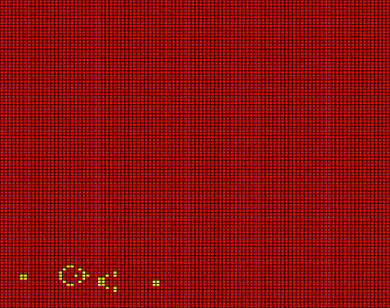

% Game of Life Documentation
% Math 466
% Minyoung Heo

# Overview

Made 3 different tests: 1 random, 1 blinker, 1 glider, and 1 glider gun.

## Random Test

Using `rand` function, I was able to make a random board of $n \times n$ with 1s and 0s given a certain "density" (the larger the density, the more it is going to place 1s). Here is a simulation of 1000 generations of 100x100 grid with a density of 0.1.


_**The Test Code**_

```
gens = 1000;

n = 100;

Init\_Config = zeros(n);


density = .10;

spawnCount = 0;


for i=1:n

for j=1:n

tospawn = 0;

if rand < density

tospawn = 1;

spawnCount = spawnCount+1;

end

Init\_Config(i,j) = tospawn;

end

end

disp("spawned: " + spawnCount);


% Init\_Config(5, 5) = 1;

% Init\_Config(5, 6) = 1;

% Init\_Config(5, 4) = 1;


%%

global log

log = fopen("outputlog.txt", "w");

fprintf(log, "%d %d %d %d %d %d %d %d %d %d\n", Init\_Config);

A = Life(Init\_Config, gens);

mov = Life\_Animation\_alt(A, 1);

v = VideoWriter('randomlife.avi');

open(v)

writeVideo(v, mov);

close(v);
```

## Blinker Test

_**The Test Code**_

```
gens = 10;

n = 5;

Init\_Config = zeros(n);

Init\_Config(3, 3) = 1;

Init\_Config(3, 4) = 1;

Init\_Config(3, 2) = 1;

%%

global log

log = fopen("outputlog.txt", "w");

fprintf(log, "%d %d %d %d %d %d %d %d %d %d\n", Init\_Config);

A = Life(Init\_Config, gens);

mov = Life\_Animation\_alt(A, 1);

v = VideoWriter('blinkerlife.avi');

open(v)

writeVideo(v, mov);

close(v);

```


## Glider Test

The "glider" that travels infinitely if it's not stopped.

_**The Test Code**_

```
gens = 400;

n = 100;

Init\_Config = zeros(n);

Init\_Config(2, 4) = 1;

Init\_Config(3, 2) = 1;

Init\_Config(3, 4) = 1;

Init\_Config(4, 3) = 1;

Init\_Config(4, 4) = 1;

%%

global log

log = fopen("outputlog.txt", "w");

fprintf(log, "%d %d %d %d %d %d %d %d %d %d\n", Init\_Config);

A = Life(Init\_Config, gens);

mov = Life\_Animation\_alt(A, 1);

v = VideoWriter('gliderlife.avi');

open(v)

writeVideo(v, mov);

close(v);

```


## Glider Gun

Made this one for fun but also to show that this works

_**Test Code**_

```
gens = 400;

n = 100;

Init\_Config = zeros(n);

<!--[if mso]><br><![endif]-->

glider\_gun = \[

% 1, 2 3 4 5 6 7 8 9 10,11,12 13 14 15 16 17 18 19 20

0, 0, 0, 0, 0, 0, 0, 0, 0, 0, 0, 0, 0, 0, 0, 0, 0, 0, 0, 0, 0, 0, 0, 0, 1, 0, 0, 0, 0, 0, 0, 0, 0, 0, 0, 0, 0, 0, 0, 0;

<!--[if mso]><br><![endif]-->

% 1, 2 3 4 5 6 7 8 9 10,11,12 13 14 15 16 17 18 19 20

0, 0, 0, 0, 0, 0, 0, 0, 0, 0, 0, 0, 0, 0, 0, 0, 0, 0, 0, 0, 0, 0, 1, 0, 1, 0, 0, 0, 0, 0, 0, 0, 0, 0, 0, 0, 0, 0, 0, 0;

<!--[if mso]><br><![endif]-->

% 1, 2 3 4 5 6 7 8 9 10,11,12 13 14 15 16 17 18 19 20

0, 0, 0, 0, 0, 0, 0, 0, 0, 0, 0, 0, 1, 1, 0, 0, 0, 0, 0, 0, 1, 1, 0, 0, 0, 0, 0, 0, 0, 0, 0, 0, 0, 0, 1, 1, 0, 0, 0, 0;

<!--[if mso]><br><![endif]-->

% 1, 2 3 4 5 6 7 8 9 10,11,12 13 14 15 16 17 18 19 20

0, 0, 0, 0, 0, 0, 0, 0, 0, 0, 0, 1, 0, 0, 0, 1, 0, 0, 0, 0, 1, 1, 0, 0, 0, 0, 0, 0, 0, 0, 0, 0, 0, 0, 1, 1, 0, 0, 0, 0;

<!--[if mso]><br><![endif]-->

% 1, 2 3 4 5 6 7 8 9 10,11,12 13 14 15 16 17 18 19 20

1, 1, 0, 0, 0, 0, 0, 0, 0, 0, 1, 0, 0, 0, 0, 0, 1, 0, 0, 0, 1, 1, 0, 0, 0, 0, 0, 0, 0, 0, 0, 0, 0, 0, 0, 0, 0, 0, 0, 0;

<!--[if mso]><br><![endif]-->

% 1, 2 3 4 5 6 7 8 9 10,11,12 13 14 15 16 17 18 19 20

1, 1, 0, 0, 0, 0, 0, 0, 0, 0, 1, 0, 0, 0, 1, 0, 1, 1, 0, 0, 0, 0, 1, 0, 1, 0, 0, 0, 0, 0, 0, 0, 0, 0, 0, 0, 0, 0, 0, 0;

<!--[if mso]><br><![endif]-->

% 1, 2 3 4 5 6 7 8 9 10,11,12 13 14 15 16 17 18 19 20

0, 0, 0, 0, 0, 0, 0, 0, 0, 0, 1, 0, 0, 0, 0, 0, 1, 0, 0, 0, 0, 0, 0, 0, 1, 0, 0, 0, 0, 0, 0, 0, 0, 0, 0, 0, 0, 0, 0, 0;

<!--[if mso]><br><![endif]-->

% 1, 2 3 4 5 6 7 8 9 10,11,12 13 14 15 16 17 18 19 20

0, 0, 0, 0, 0, 0, 0, 0, 0, 0, 0, 1, 0, 0, 0, 1, 0, 0, 0, 0, 0, 0, 0, 0, 0, 0, 0, 0, 0, 0, 0, 0, 0, 0, 0, 0, 0, 0, 0, 0;

<!--[if mso]><br><![endif]-->

% 1, 2 3 4 5 6 7 8 9 10,11,12 13 14 15 16 17 18 19 20

0, 0, 0, 0, 0, 0, 0, 0, 0, 0, 0, 0, 1, 1, 0, 0, 0, 0, 0, 0, 0, 0, 0, 0, 0, 0, 0, 0, 0, 0, 0, 0, 0, 0, 0, 0, 0, 0, 0, 0;

];

<!--[if mso]><br><![endif]-->

glider\_gun

<!--[if mso]><br><![endif]-->

for i=1:9

for j=1:40

Init\_Config(i + 5, j + 5) = glider\_gun(i, j);

end

end

<!--[if mso]><br><![endif]-->

%%

global log

log = fopen("outputlog.txt", "w");

fprintf(log, "%d %d %d %d %d %d %d %d %d %d\n", Init\_Config);

<!--[if mso]><br><![endif]-->

A = Life(Init\_Config, gens);

mov = Life\_Animation\_alt(A, 1);

<!--[if mso]><br><![endif]-->

v = VideoWriter('glidergunlife.avi');

open(v)

writeVideo(v, mov);

close(v);

```



