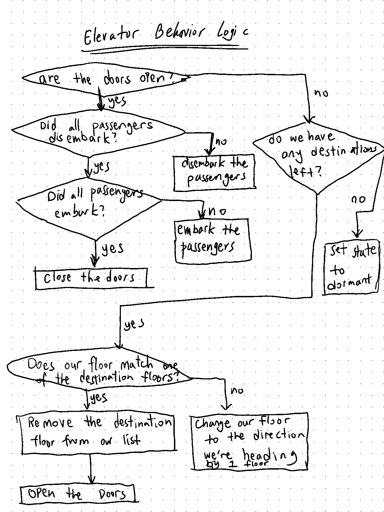
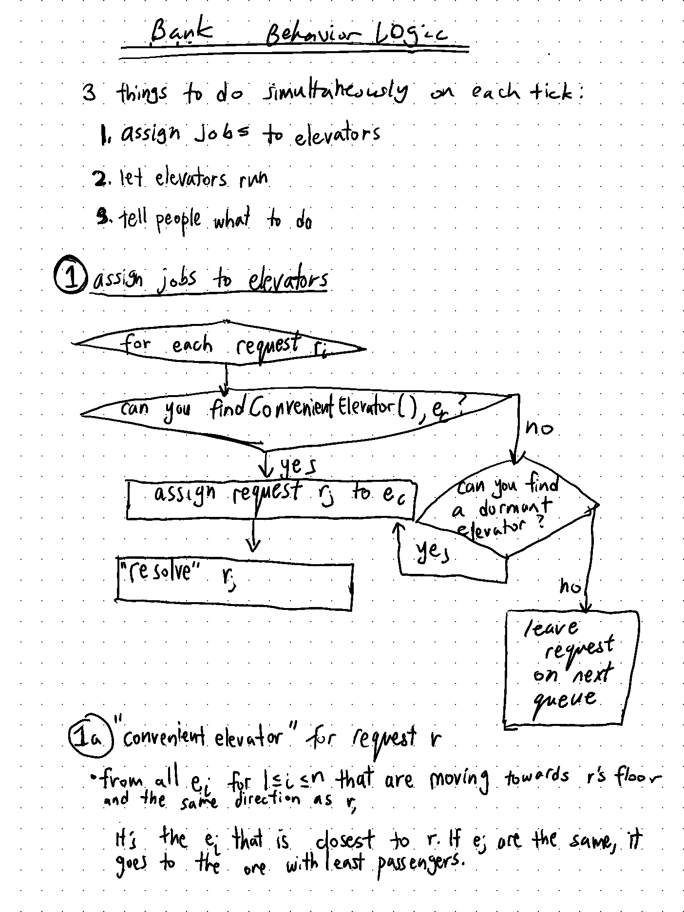
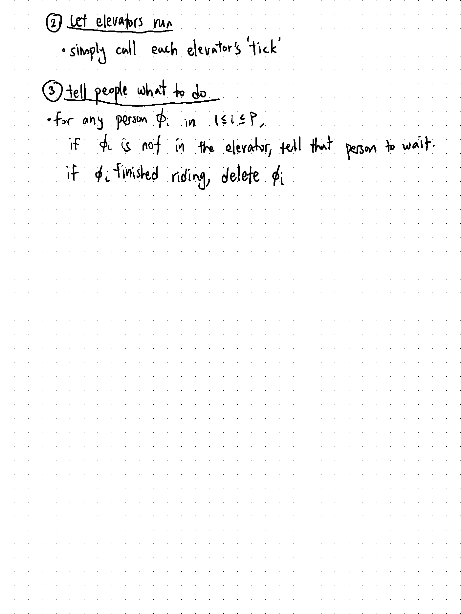

% Elevator Doc
% Math 466
% Minyoung Heo

# Code Doc

## Code Ref

### Elevator

An object representing an elevator that goes up and down the building.

_**contains data regarding**_

* Which floor it's in

* Whether it's moving up, down, or dormant

* How many passengers are in it

* List of destinations $d_1, ..., d_m$ (where each $d_m$ is a true/false value that tells whether or not the elevator should go to that floor)

* whether the doors are opened or closed

_**Behavior**_:

At the start all elevators start at floor 1.

Each **Elevator** does 1 thing each time interval:

* move up/down

* pause on each stop for doors to open

* drop people off

* allow people to get on

* pause on each stop for doors to close

### Person

An object representing people that go up and down elevators to their floors. This object does not "behave" as in it doesn't get behaviors to act on its own will (basically, it doesn't have its own "tick" function). Instead, it gets told what to do, and keeps data regarding that.

_**contains data regarding**_

* the destination floor they want to go

* how long they waited

_**Behavior**_:

At the start, people "spawn" at random floors each with their random request ("I want to move to floor X").

Each _**Person**_ does 1 thing each time interval:

* wait for an elevator

* enter an elevator

* wait during the ride of the elevator

* get off the elevator (despawn)

### Bank

An object that represents the system of all the banks of elevators. This should handle the requests from Persons and should move the elevators up or down. 

_**contains data regarding**_

* series of elevators $e_1, ..., e_n$

* series of requests $r_1, … r_m$ (where $m=$ the number of floors of the bank). Each $r_i$ is a 2-bit data where the ones bit is "up" and the twos bit is "down" (i.e. 1 is up, 2 is down, 3 is both up and down) on the $i$th floor

## List of Objectives and Corresponding Logic

### It should just work right? Initial ideas

Simple model: let's just get people to their floors. The bank will check to see if there are any requests. Suppose there is a request on floor $i$. It will check to see if there are any elevators on its way to floor $i$ (below $i$ going up or above $i$ going down) AND if the request matches the direction the elevator is moving. If there are no elevators on the way, it checks for dormant elevators. If there are no elevators available, the system just leaves that request untouched until an eligible elevator is found. 

To the matching elevator, the system will then forward that request to the elevator. Each frame will output data regarding Elevators, max wait time, the current time, and energy consumption. 

