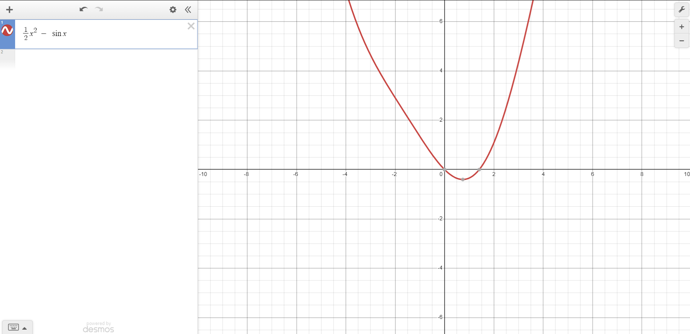

% Lecture 10
% Math 467
%	Jan 31 2024

# Newton Method

Let $f: I \mapsto \R$, $I \subset \R$, $f \in C^2$, $f^{\prime \prime} > 0$. 

Find a minimizer $x^* \in I$.

Start with $x_0 \in I$, then improve successively $x_1, x_2, ...$ hopefully, $x_k \rightarrow x^*$. Approximate $f$ by parabola $q_k$ at $x_k$.

Use Taylor's Approximation

$$
f(x) = f(x_k) + f^\prime(x_k)(x - x_k) + \frac{1}{2}f^{\prime \prime}(x_k)(x-x_k)^2 + r_3(x-x_k)
$$

where remainder $r_3(x) = o(|x-x_k|^2)$. if $f \in C^3$,

$$
r_3(x) = \frac{1}{3!}f^{\prime \prime \prime}(\hat{x})(x-x_k)^3
$$

where $\hat{x} = x_k + \rho(x - x_k)$ for some $0 \leq \rho \leq 1$. Put $q_k(x) = f(x_k) + f^\prime(x_k)(x - x_k) + \frac{1}{2}f^{\prime \prime}(x-x_k)^2$. Now minimize $q_k$.

$$
q_k^\prime(x) = f^\prime(x_k) + f^{\prime \prime}(x-x_k)
$$

put $q_k^\prime(x) = 0$ and value for $x$, 

$$
f^\prime(x_k) = -f^{\prime \prime}(x_k)(x-x_k) \rightarrow x-x_k = -\frac{f^\prime(x_k)}{f^{\prime \prime}(x_k)}
$$

So we get the recursive formula

$$
x_{k+1} = x_k - \frac{f^\prime(x_k)}{f^{\prime \prime}(x_k)}
$$

## How well does this method work?

Assume $f \in C^3$. $f(x) = q_k(x) + r_3(x)$ where $g_3(x) = \frac{1}{6}f^{\prime \prime \prime}(\hat{x})(x-x_k)^3$. for $g = f^\prime$, we get 

$$
g(x) = q_k^\prime(x) + \frac{1}{2}f^{\prime \prime \prime}(\hat{x})(x-x_k)^2
$$

set $\tilde{r}_3(x) = \frac{1}{2} f^{\prime \prime \prime}(\hat{x})(x-x_k)^2 = O(|x-x_k|^2)$. We are off by this much. Therefore, the error $\epsilon_{k+1} = |x^* - x_{k+1}|$

$$
\epsilon_{k+1} = O(\epsilon_k^2)
$$

That means, there is a constant $C < \infty$ (finite) usch that $\epsilon_{k+1} \leq C \cdot \epsilon_k^2$.

Start out with error $\epsilon_1$, then $\epsilon_2 \leq C \cdot \epsilon_1^2$ and $\epsilon_3 \leq C \cdot \epsilon_2^2 \leq C \cdot \epsilon_1^4$ …

$$
\epsilon_k \leq C^{2^{k-1}-1} \epsilon_1^{2^{k-1}} = \frac{1}{C}(C\cdot\epsilon_1)^{2^{k+1}}
$$

Verify by induction. 

Initial Approximation $x_1$ has to be good enough (don't get too far into the wilderness) such that $C \cdot \epsilon_1 < 1$

## Example where Newton's method does not work

Take $g(x) = x^\frac{1}{3}$. $g^\prime(x) = \frac{1}{3}x^{-\frac{2}{3}}$, With Newton's recursion, 

$$
\begin{aligned}
x_{k+1} = x_k \frac{g(x_k)}{g^\prime{x_k}} \\
= x_k - \frac{x_k^\frac{1}{3}}{\frac{1}{3}x^{-\frac{2}{3}}} \\
= x_k - 3x_k = -2x_k
\end{aligned}
$$

This goes to $x_k \rightarrow \pm \infty$ as $k \rightarrow \infty$.

## Example from book

$$
f(x)  = \frac{1}{2}x^2 - \sin x
$$

Start at $x_0 = \frac{1}{2}$. 

$$
\begin{aligned}
f^\prime(x) = x - \cos x \\
f^{\prime \prime}(x) = 1 + \sin x
\end{aligned}
$$

$$
\begin{aligned}
\rightarrow x_{k+1} = x_k - \frac{x_k - \cos x_k}{1 + \sin x} \\
= \frac{x_k + x_k \sin x_k - x_k + \cos x_k}{1 + \sin x_k} \\
= \frac{x_k \sin x_k + \cos x_k}{1+\sin x_k}
\end{aligned}
$$
$$
\begin{aligned}
x_0 = 0.5 \\
x_1 = 0.7552 \\
x_2 = 0.7391 \\
x_3 = 0.7391
\end{aligned}
$$

# Secant Method

Suppose there is no 2nd derivative ($g = f^\prime$ has no derivative). $s_k$ slope of line passes through points $(x_{k-1}, g(x_{k-1}))$ and $(x_k, g(x_k))$.

$$
s_k = \frac{g(x_{k-1}) - g(x_k)}{x_{k-1}-x_k}
$$

We get the secant formula

$$
\begin{aligned}
x_{k+1} = x_k - \frac{g(x_k)}{s_k} \\
x_{k+1} = x_k - \frac{g(x_k)}{\frac{g(x_{k-1}) - g(x_k)}{x_{k-1}-x_k}} \\
= x_k - \frac{g(x_k)(x_{k-1}-x_k)}{g(x_{k-1})-g(x_k)} \\
= \frac{x_kg(x_{k-1})-g(x_k)x_{k-1}}{g(x_{k-1}) - g(x_k)}
\end{aligned}
$$

Two point recursion, initialize with two points.

