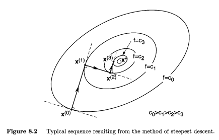

% Lecture 11
% Math 467
% Feb 2 2024

minimizing $f:\R^n \mapsto \R$ (unconstricted problem)

For $n = 2$, you can plot level curves: $L_c = \{x \in \R^n, f(x) = c\}$. 

We want to find minizer $x^*$ through approximating sequences $x^k$. 

Note: $\nabla f$ is orthogonal to $L_c$. Let $d$ be a tangent vector to $L_c$. Then, pick a curve $x(t) \in L$ so that $x^\prime(0) = d$. That is, $\phi(t) = f(x(t)) = c$ for $x(t) \in L$.

$$
\phi^\prime(t) = \nabla f(x(t)) \cdot x^\prime(t) = x^\prime(t)^\perp \cdot \nabla f(x(t))
$$

But $d^T \nabla f = 0$, so $d \perp \nabla f$ since $d$ is tangental to $L_c$. 

The direction of fastest descent is $-\nabla f(x^k)$. Put

$$
x(\alpha) = x^k - \alpha \nabla f(x^k), \alpha \geq 0
$$

put

$$
\nabla f(x^k) = g^k
$$

or 

$$
x(\alpha) = x^k - \alpha g^k, \alpha \geq 0
$$

Let $\alpha^k = \min_{\alpha \geq 0} f(x^k - \alpha g^k)$

Then put 

$$
x^{k+1} = x^k - \alpha_k g^k
$$

# Lemma

Let $x^k$ be given by the gradient descent method. $x^{k+1} = x^k - \alpha_k g^k$

$$
\alpha^k = \min_{\alpha \geq 0} f(x^k - \alpha g^k), g^k = \nabla f(x^k)
$$

Then $x^{k+2} - x^{k+1} \perp x^{k+1} - x^k$

_Proof_

Let $\alpha_k$ come from minimizing $\phi_k(\alpha) = f(x^k - \alpha g^k)$. By FONC

$$
\begin{aligned}
0 = \phi^\prime_k (\alpha_k) = \phi^\prime_k(\alpha) |_{\alpha=\alpha_k} \\
= \left(\frac{d}{dx} f(x^k - \alpha g^k)\right)|_{\alpha=\alpha_k} \\
= \nabla f(x^k - \alpha g^k) \cdot (-g^k) |_{\alpha=\alpha_k} \\
= -\nabla f(x^{k+1})g^k = -\nabla f(x^{k+1})\nabla f(x^k) \\
\rightarrow g^{k+1}g^k = 0 (\text{i.e. } g^{k+1} \perp g^k) \\
\\
\rightarrow x^{k+2} - x^{k+1} = \alpha_{k+1}\cdot g^{k+1}, x^{k+1} - x^k = \alpha_k g^k \\
\rightarrow x^{k+2} - x^{k+1} \perp x^{k+1} x^k
\end{aligned}
$$

# Corollary

If $\alpha_k \neq 0$, that means $x_{k+1} \neq x_k$ (we moved somewhere), then

$$
f(x^k+1) < f(x^k)
$$

_Proof_

$$
\begin{aligned}
\phi_k(\alpha) = f(x^k - \alpha g^k)\\
\\
\phi^\prime(\alpha) = \nabla f(x^k-\alpha g^k)(-g^k) \\
= -(g^k)^T \nabla f(x^k - \alpha g^k)
\end{aligned}
$$

Put $\alpha = 0$.

$$
\begin{aligned}
\phi_k^\prime(0) = -(g^k)^T \nabla f(x^k) = -(g^k)^T g^k\\
= -||g^k||^2
\end{aligned}
$$

If $x^k \neq x^*$, then $g^k \neq 0$, which means $\phi^\prime_k(0) < 0$.

# When do we stop interation?

1. $\nabla f(x^k)$ is small

2. $f(x^k) - f(x^{k+1})$ is small (you haven't improved that much)

3. $||x^k - x^{k+1}||$ is small

4. $\frac{f(x^k) - f(x^{k+1})}{f(x^k)}$ is small (a relative measure)

5. $\frac{||x^k - x^{k+1}||}{||x^k||}$ is small

# Special Case when $f$ is quadratic in $\R^n$

$$
f(x) = \frac{1}{2} x^T Q x - b^T x
$$

where $Q \in \R^{n \times n}$, $Q = Q^T$. (Even if $Q$ is not symmetrical, we can make it symmetrical: $Q = \frac{1}{2}(A + A^T)$). And $b \in \R^n$.

The gradient of $f$

$$
\nabla f(x) = Qx - b
$$

The Hessan of $f$

$$
F = Q
$$

If $x^*$ is a minimizer, then $F$ has to be positive definite. So it's safe to assume $Q$ is positive definite.  So the eigenvalues are real and positive.

So $x^k$ is given by the gradient method. 

$$
x^{k+1} = x^k - \alpha_k g^k, g^k = \nabla f(x^k) = Qx^k - b
$$

$$
\alpha_k = \min_{\alpha \geq 0} f(x^k-\alpha g^k)
$$

Put $\phi_k(\alpha) = f(x^k - \alpha g^k)$. By FONC, $0 = \phi^\prime(\alpha) = \nabla f(x^k - \alpha g^k)(-g^k) = -(g^k)^T \nabla f(x^k - \alpha g^k)$

$$
\begin{aligned}
= -(g^k)^T(Q(x^k - \alpha g^k)- b) \\
=  -(g^k)^T (Qx^k - \alpha Q g^k - b)\\
\\
0 = -(g^k)^T(Qx^k-b) + \alpha_k (g^k)^T Q g^k \\
\rightarrow \alpha_k = \frac{(g^k)^T g^k}{(g^k)^T Q g^k}
\end{aligned}
$$

## What is the speed of convergence?

Put $V(x) = (x - x^*)^T Q(x-x^*)$. Then with a good choice of $x^*$ we get 

$$
f(x) = V(x) + \text{ const}
$$

$$
\begin{aligned}
f(x) = \frac{1}{2} x^T Q x - b^T x \\
V(x) = \frac{1}{2} (x-x^*)^T Q (x-x^*))\\
= \frac{1}{2}x^T Q x - x^TQ x^* (+ \frac{1}{2} x^{*^T} Q x^* \text{ this is constant}) 
\end{aligned}
$$

if $x^TQx^* = b^Tx = x^Tb$, choose $x^*$ so that $Qx^* = b$, or $x^* = Q^{-1}b$. ($Q^{-1}$ exists because eqigenvalues of $Q$ are nonzero). We look for minimizer of $V(x)$.